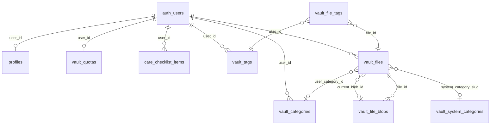

# schema (public + storage)

referência canónica alinhada à migration
[`0004_remodel_context_vault.sql`](../supabase/migrations/0004_remodel_context_vault.sql).
narrativa e regras de negócio: [vault/model.md](vault/model.md).

## extensões

| extensão   | uso                          |
|------------|------------------------------|
| `pgcrypto` | `gen_random_uuid()`          |
| `unaccent` | busca e trigger `search_vector` |

## diagrama (er)

**regra `vault_files_category_scope`:** se `status` é `ready`, então
exatamente um entre `system_category_slug` e `user_category_id` está preenchido; se
`status` em (`pending`, `failed`), os dois podem ser null.

## tabelas `public`

### `profiles`

| coluna        | tipo        | notas |
|---------------|------------|--------|
| user_id       | uuid pk    | → `auth.users(id)` on delete cascade |
| display_name  | text       | null   |
| care_role     | text       | null ou `self` \| `caregiver` |
| created_at    | timestamptz| default now() |
| updated_at    | timestamptz| trigger |

### `care_checklist_items`

| coluna     | tipo        | notas |
|------------|------------|--------|
| user_id    | uuid       | → `auth.users`, pk composto |
| item_key   | text       | pk composto; contrato com o catálogo em código |
| done       | boolean    | default false |
| updated_at | timestamptz| trigger `set_updated_at` |

### `vault_system_categories`

| coluna     | tipo | notas |
|------------|------|--------|
| slug       | text pk | ex.: `juridico`, `outros` |
| label      | text not null | |
| icon       | text | nome lucide |
| color      | text | hex |
| sort_order | int  | default 0 |

seeds: 8 linhas (juridico, saude, financeiro, trabalho, viagem, imoveis, pessoal, outros).

### `vault_categories`

| coluna     | tipo | notas |
|------------|------|--------|
| id         | uuid pk | default `gen_random_uuid()` |
| user_id    | uuid not null | → `auth.users` |
| slug, label| text not null | |
| icon, color| text | null |
| sort_order | int not null default 0 | |
| created_at | timestamptz | |

unique `(user_id, slug)`.

### `vault_tags`

| coluna     | tipo | notas |
|------------|------|--------|
| id         | uuid pk | |
| user_id    | uuid not null | |
| slug, label| text not null | |
| created_at | timestamptz | |

unique `(user_id, slug)`.

### `vault_files`

| coluna                 | tipo | notas |
|------------------------|------|--------|
| id                     | uuid pk | |
| user_id                | uuid not null | |
| current_blob_id        | uuid | null → `vault_file_blobs.id` on delete set null (`vault_files_current_blob_fk`) |
| display_name           | text not null | 1..255 |
| original_name          | text not null | |
| system_category_slug   | text | → `vault_system_categories.slug` on delete set null |
| user_category_id       | uuid | → `vault_categories.id` on delete set null |
| manual_override        | bool not null default false | |
| confidence             | numeric(3,2) | 0..1 ou null |
| description            | text | max 2000 se não null |
| favorite, is_private   | bool | |
| status                 | text | `pending` \| `ready` \| `failed` |
| text_content           | text | ocr / extrato, futuro |
| search_vector          | tsvector | trigger português + unaccent |
| version_count          | int not null default 0 | trigger a partir de blobs |
| created_at, updated_at, deleted_at | timestamptz | soft delete: `deleted_at` |

índices notáveis: `(user_id, deleted_at, created_at desc)`; gin em `search_vector`;
parcial categoria sistema `(user_id, system_category_slug) where …`.

### `vault_file_blobs`

| coluna       | tipo | notas |
|--------------|------|--------|
| id           | uuid pk | |
| file_id      | uuid not null | → `vault_files` cascade |
| version      | int not null | |
| storage_path | text not null unique | |
| mime_type, extension | text not null | |
| size_bytes   | bigint not null | > 0 |
| sha256       | text not null | 64 hex |
| uploaded_at  | timestamptz | |

unique `(file_id, version)`.

### `vault_file_tags`

| coluna  | tipo | notas |
|---------|------|--------|
| file_id | uuid | pk composto → `vault_files` |
| tag_id  | uuid | pk composto → `vault_tags` |

### `vault_quotas`

| coluna      | tipo | notas |
|-------------|------|--------|
| user_id     | uuid pk | → `auth.users` |
| tier        | text not null | `free` \| `premium` \| `enterprise` |
| limit_bytes | bigint not null | default 524288000 |
| used_bytes, file_count | bigint / int | recalculado por trigger |
| updated_at  | timestamptz | |

## `storage` (supabase)

| objeto    | notas |
|-----------|--------|
| bucket `vault` | privado, `file_size_limit` 52428800 |
| `storage.objects` | policies: primeiro segmento do path = `auth.uid()::text` para crud no bucket `vault` |

caminho típico de objeto: `{user_id}/{file_id}.{ext}` (ver `buildStoragePath` na app).

## triggers resumidos (funções `public`)

| gatilho / função | tabela alvo | efeito |
|------------------|-------------|--------|
| `set_updated_at` | profiles, care, vault_quotas, vault_files | `updated_at := now()` |
| `handle_new_user` | após insert `auth.users` | insere `profiles` e `vault_quotas` se faltando |
| `vault_files_update_search` | vault_files | preenche `search_vector` |
| `vault_file_blobs_sync_version_count` | após dml em `vault_file_blobs` | actualiza `vault_files.version_count` |
| `vault_files_quota_after` / `vault_blobs_quota_after` | vault_files, vault_file_blobs | chama `vault_quotas_recalc` |

## fora do `public` (auth)

`auth.users` — fonte de identidade; fk em todas as tabelas listadas com `user_id`.
